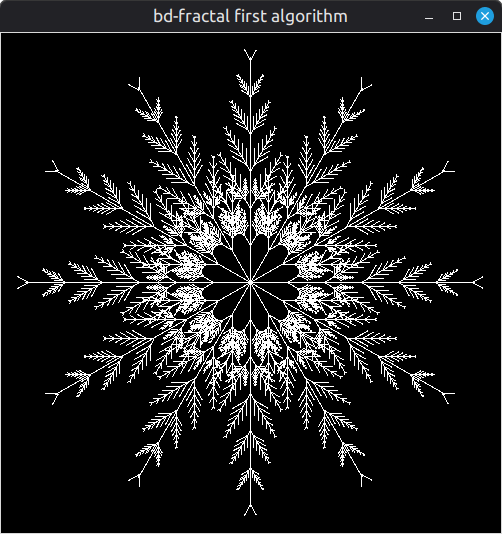

# bd-fractal

boot.dev "First Personal Project"

# Purpose

- none, just had to think of something for a project
- long ago I downloaded some code that did an animated fractal screen saver thing
- I want to make something like that, but actually know how it works

# Initial plan

- use `tkinter` and draw interactively, not making images
- first idea is just a recursive line algorithm, like pine needles
- then the famous ones from https://mathworld.wolfram.com/Fractal.html, may switch to https://matplotlib.org/ for this part

# Update plan

- I think I'm already doing more than project scope and I'm not finished
- so I won't get to any of the other fractals for this submission
- I'm sure I will add them later, because I'm having fun with it

# TODO

- add UI for parameters
- add save image button
- do something with color

# Dependencies

- `uv`  
  https://github.com/astral-sh/uv
- `tkinter`  
  it did not come installed for me; Linux Mint 22.1  
  https://tkdocs.com/tutorial/install.html
- `numpy` comes with python

# Run

```shell
uv run src/main.py
```

# Notes

- I do not follow Python conventions, because they are wrong and nobody is paying me too suffer
- seriously, if you like snake case your brain is broken

## `first.py`

- it does what I wanted, it is a wheel of repeating patterns
- each spoke of the wheel is recursively processed, adding branches decreasing in sized at an interval
- I changed the background black and lines white, it is becoming a snowflake generator


